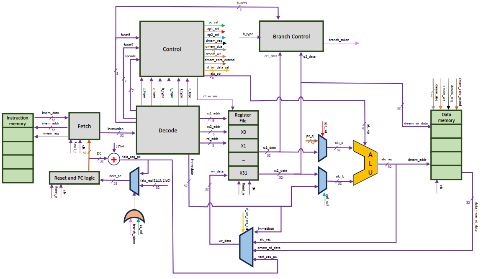
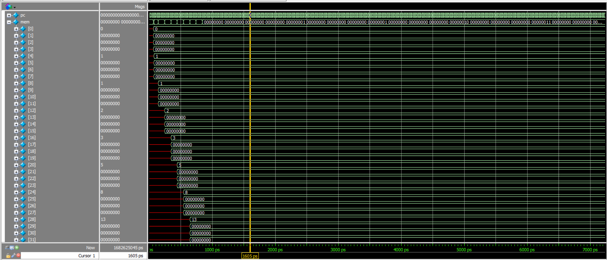

<h1 align="center">RISC-V RV32I Single-Cycle CPU (SystemVerilog)</h1>
<p align="center">
  SystemVerilog Implementation of a 32-bit RISC-V Processor
</p>

A complete implementation of a **32-bit RISC-V (RV32I) single-cycle processor** written in SystemVerilog.
This project demonstrates the full design flow of a CPU — from instruction decoding to executing real programs on custom hardware.

---

## 🚀 Overview

This processor is built as a clean, modular hardware system that connects software and hardware end-to-end.
It supports the full **RV32I instruction set** and executes programs in a **single-cycle architecture**.

> The goal of this project is not only to build a CPU, but to deeply understand how instructions are translated into hardware operations.

---

## 🎯 Project Objectives

* Understand the **RISC-V RV32I ISA** at the bit level
* Translate instruction formats into hardware logic
* Design a **modular and scalable datapath**
* Execute real programs on a custom processor
* Demonstrate the interaction between **software and hardware**

---

## ⚙️ Features

* **ISA**: RISC-V RV32I
* **Architecture**: Single-cycle
* **Language**: SystemVerilog
* **Simulation**: ModelSim / Questa

### ✔ Supported Instruction Types

* R-type
* I-type (Arithmetic, Load, JALR)
* S-type
* B-type
* U-type (LUI, AUIPC)
* J-type (JAL)

### ✔ Memory

* Byte-addressable instruction memory
* Byte-addressable data memory

---

## 🧠 Architecture

The processor is built using clearly separated modules:

* Instruction Memory
* Fetch Unit
* Decode Unit
* Register File
* ALU
* Data Memory
* Branch Control
* Control Unit
* Top-Level Integration

All shared definitions (opcodes, ALU operations, control signals) are centralized in a SystemVerilog package (`risc_pkg.sv`) for clarity and scalability.

---

## 🖼️ CPU Datapath


<p align="center">
  
</p>

---

## 📁 Project Structure

```bash
rtl/        # Core CPU design (SystemVerilog)
tb/         # Testbench
mem/        # Programs (machine code)
sim/        # Simulation scripts (run.do)
docs/       # Images, diagrams, waveform
```

---

## 🧪 Simulation

### ▶ Run the simulation

```bash
cd sim
vsim -do run.do
```

### 🔍 What to observe

* Program Counter (PC)
* Instruction flow
* ALU operations
* Register write-back
* Memory access

---

## 📊 Simulation Results

### Fibonacci Program Execution


<p align="center">
  
</p>


---


## 💻 Programs Executed

### 🔢 Fibonacci Sequence Generator

* Iterative computation
* Results stored in memory

The program includes:

* Pseudocode
* RISC-V assembly
* Machine code (`.mem`)

---

## 🔧 Requirements

* ModelSim or QuestaSim
* SystemVerilog support

---

## 🧭 Future Improvements

* Pipeline architecture (5-stage)
* Hazard detection and forwarding
* Cache integration
* Performance optimization

---

## 📜 License

This project is licensed under the MIT License.

---

## 👨‍💻 Author

**Mohamed Reda EZ-ZOUHRY**
Embedded Systems & Control Engineering Student

---

## ⭐ Note

This project is a step toward mastering CPU design and low-level system architecture.
It reflects a deep understanding of how instructions are executed at the hardware level.
